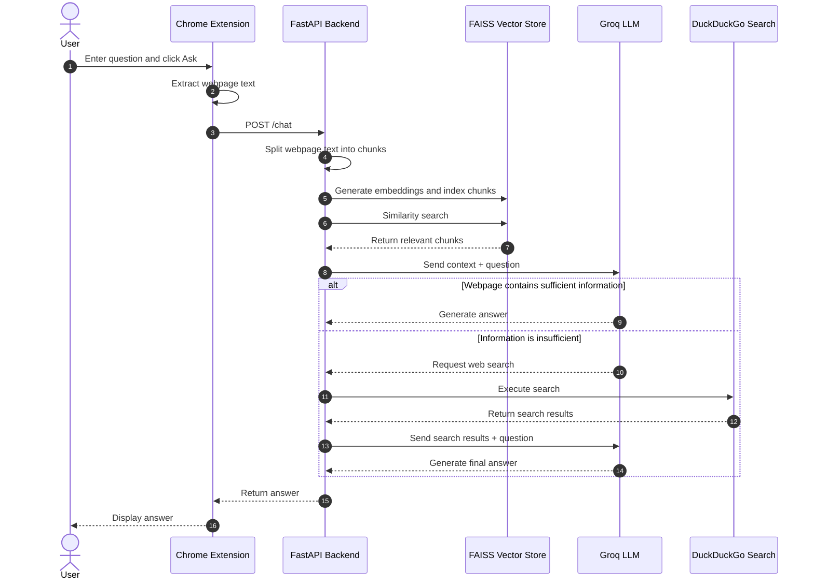

# PageSense – AI-Powered RAG Web Chat

PageSense is an AI-powered Chrome extension that allows users to chat with any webpage in real time. Users can open a webpage, ask questions about its content, and receive context-aware answers using Retrieval-Augmented Generation (RAG).

The application extracts webpage content, divides it into smaller chunks, generates embeddings, stores them in a FAISS vector store, retrieves the most relevant information, and uses an LLM to generate the final response. When the webpage does not contain enough information, the system can use web search as a fallback.

## ✨ Features

* 💬 Chat with any webpage
* 🔎 Context-aware question answering using RAG
* 🧠 Semantic search using HuggingFace embeddings
* ⚡ FAISS-based vector similarity search
* 🤖 LLM-powered response generation using Groq
* 🌐 Web-search fallback using DuckDuckGo
* 🔄 Multi-turn conversational memory
* 🧩 Chrome Extension using Manifest V3
* 🚀 FastAPI backend for communication between the extension and AI pipeline

## 🏗️ System Architecture



## 🔄 How It Works

1. The user opens a webpage in Chrome.
2. The PageSense extension extracts the visible webpage text.
3. The extracted content is sent to the FastAPI backend.
4. The backend splits the webpage content into smaller chunks.
5. Each chunk is converted into an embedding using `BAAI/bge-small-en`.
6. The embeddings are stored in a FAISS vector store.
7. The user's question is converted into a semantic search query.
8. FAISS retrieves the most relevant webpage chunks.
9. The retrieved context is sent to the Groq-powered LLM.
10. The LLM generates an answer using the retrieved context.
11. If the webpage does not contain sufficient information, the application can invoke DuckDuckGo web search.
12. The final answer is returned to the Chrome extension and displayed to the user.

## 🧠 RAG Pipeline

PageSense follows the basic Retrieval-Augmented Generation pipeline:

```text
Webpage
   ↓
Text Extraction
   ↓
Text Chunking
   ↓
Embedding Generation
   ↓
FAISS Vector Store
   ↓
Similarity Search
   ↓
Relevant Context
   ↓
Groq LLM
   ↓
Final Answer
```

## 💬 Conversational Memory

PageSense supports multi-turn conversations.

The backend maintains session-based conversation history using a Python `deque`. The conversation history is limited to the most recent five message pairs to keep the context manageable.

Each Chrome tab uses its own session identifier, allowing conversations to remain separated between tabs.

## 🌐 Web Search Fallback

When the webpage does not contain sufficient information to answer a question, PageSense can use a DuckDuckGo search tool.

The workflow is:

```text
User Question
      ↓
Search webpage context
      ↓
Is context sufficient?
    ↙       ↘
  Yes        No
   ↓          ↓
Answer    DuckDuckGo Search
              ↓
        Search Results
              ↓
           LLM
              ↓
        Final Answer
```

## 🛠️ Technology Stack

### Frontend

* HTML
* CSS
* JavaScript
* Chrome Extension Manifest V3

### Backend

* Python
* FastAPI
* Pydantic

### AI / RAG

* LangChain
* HuggingFace Embeddings
* `BAAI/bge-small-en`
* FAISS
* Groq API
* `openai/gpt-oss-120b`

### Search

* DuckDuckGo Search

## 📁 Project Structure

```text
PageSense/
│
├── backend/
│   ├── main.py
│   ├── rag_prototype.py
│   └── requirements.txt
│
├── extension/
│   ├── content.js
│   ├── icon.jpg
│   ├── manifest.json
│   ├── popup.html
│   └── popup.js
│
├── .gitignore
├── README.md
└── requirement.txt
```

## ⚙️ Installation

### 1. Clone the repository

```bash
git clone https://github.com/Shubhoo22/PageSense.git
cd PageSense
```

### 2. Create a virtual environment

```bash
python3 -m venv .venv
```

### 3. Activate the virtual environment

macOS/Linux:

```bash
source .venv/bin/activate
```

### 4. Install dependencies

```bash
pip install -r requirement.txt
pip install -r backend/requirements.txt
```

### 5. Configure the Groq API key

Create a `.env` file in the project root:

```text
GROQ_API_KEY=your_groq_api_key
```

Do not upload the `.env` file to GitHub.

The project already includes `.env` in `.gitignore`.

## ▶️ Running the Backend

Move into the backend directory:

```bash
cd backend
```

Start the FastAPI server:

```bash
uvicorn main:app --host 127.0.0.1 --port 8000 --reload
```

The backend will run at:

```text
http://127.0.0.1:8000
```

Keep this terminal running while using the Chrome extension.

## 🌐 Loading the Chrome Extension

1. Open Google Chrome.
2. Navigate to:

```text
chrome://extensions/
```

3. Enable **Developer mode**.
4. Click **Load unpacked**.
5. Select the `extension` folder from the PageSense project.

```text
PageSense/
└── extension/
```

6. Open any webpage.
7. Click the PageSense extension.
8. Enter a question about the webpage.
9. Click **Ask**.

## 🔐 Security

The Groq API key is stored locally in `.env`.

The `.gitignore` file excludes:

```text
.env
```

Therefore, the API key should not be committed to the repository.

Never expose your API key in source code, screenshots, README files, or public repositories.

## 🚀 Future Improvements

* Persistent conversation history
* Support for selected-text question answering
* Page summarization
* Source/citation display
* Improved Chrome extension UI
* Streaming responses
* Persistent vector storage
* Better error handling
* Authentication and user-specific sessions
* Deployment of the FastAPI backend to a cloud platform

## 👨‍💻 Author

**Subham Mondal**

M.Tech – Computer Technology
Jadavpur University

GitHub: https://github.com/Shubhoo22

## 📄 License

This project is intended for educational and portfolio purposes.
